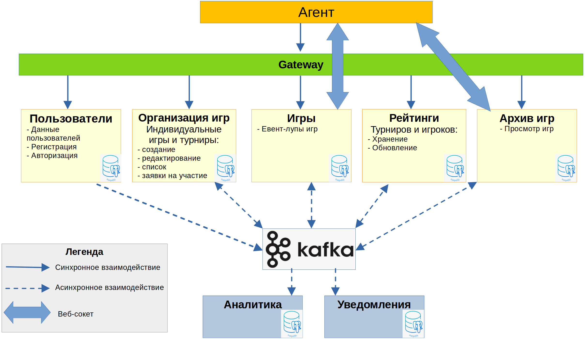
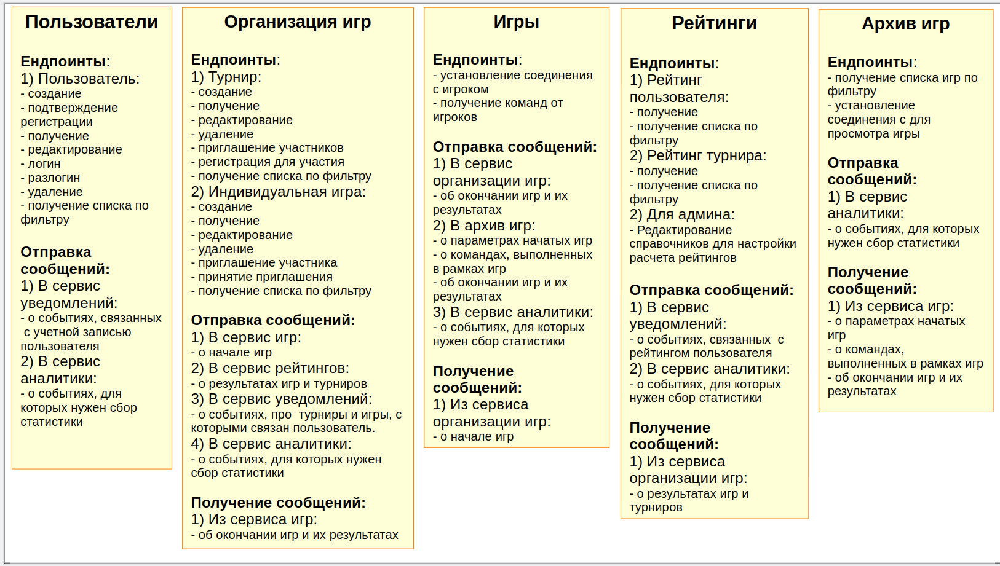
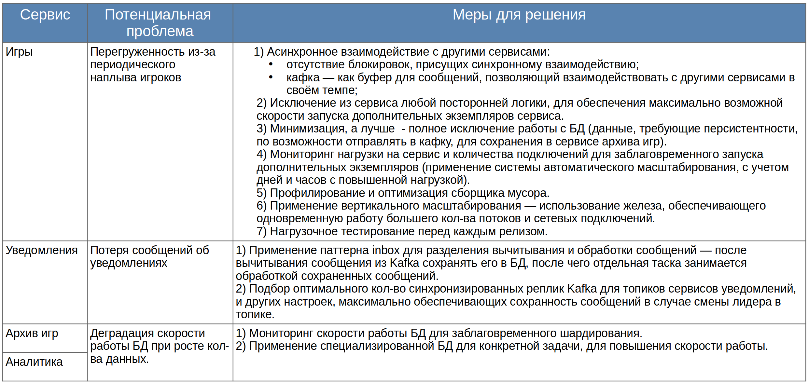
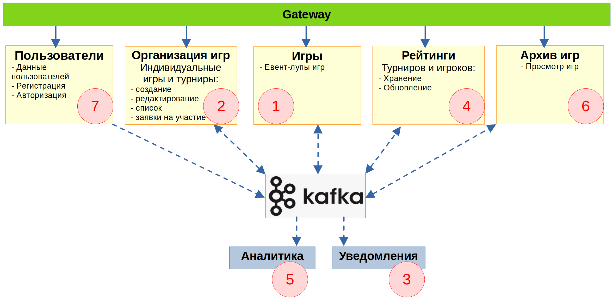
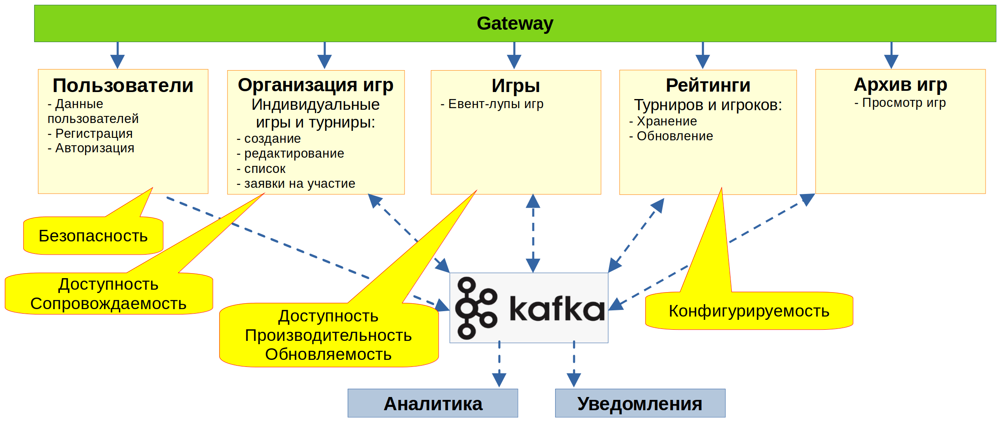

## Описание  микросервисной архитектуры игры "Космический бой"

### 1) Общая архитектура
см. легенду в нижнем левом углу

### 2) Эндпоинты и обмен сообщениями

### 3) Узкие места и потенциальные проблемы

### 4) Ожидаемая частота смены требований 
1 - max, 7 - min

1) Сервис игр (максимальная частота):
   - Функциональные требования  (новые игровые объекты, новые правила игры, новые типы игр);
   - Не функциональные требования (требования к нагрузке на сервис);
2) Сервис организации игр:
   - Функциональные требования  (новые виды турниров, новые правила турниров);
   - Не функциональные требования (требования к нагрузке на сервис);
3) Сервис уведомлений:
   - новые каналы уведомлений, 
   - новые события для уведомлений, 
   - новое содержание уведомлений;
4) Сервис рейтингов:
   - новые правила рассчета рейтингов турниров/игроков,
   - состав информации отображаемой в таблицах рейтинга.
5) Сервис аналитики:
   - изменение агрегаций собираемых данных
6) Сервис архива игр:
   - Изменение параметров просмотра архивных игр
7) Сервис пользователей (минимальная частота)

### 5) Общие архитектурные свойства сервисов

Можно сделать следующие предположения об архитектурных свойствах сервисов:

1) **Масштабируемость** — рост числа пользователей со временем, что может повлечь необходимость горизонтального масштабирования с течением времени.
2) **Адаптируемость** — неравномерная активность пользователей в течение дня, а также в течение недели, что может повлечь необходимость справляться со всплесками нагрузки в определенные дни и часы.
3) **Локализуемость** — для участия пользователей из разных стран может потребоваться поддержка разных языков.

### 6) Специфические архитектурные свойства сервисов

- **Безопасность** — шифрование информации в БД
- **Доступность** — работа в режиме 24/7, быстрое восстановление после сбоя
- **Производительность** — быстрая работа при высоких нагрузках
- **Обновляемость** — способность быстрого перехода на новую версию
- **Сопровождаемость** — легкость внесения изменений
- **Конфигурируемость** — возможность легкого изменения конфигурации администратором (через UI)

### 7) Текстовое описание к заданию

Описание содержит мотивировку принятых архитектурных решений, т.к. в архитектурных решениях первостепенную важность имеет вопрос «почему?», а не вопрос «как?»

1) Все запросы на внешний АПИ поступают синхронно по REST-full API через Gateway, **чтобы** упростить работу Агента.
2) Gateway перенаправляет запросы на нужный сервис также синхронно (**т.к. ожидается**, что обработка запросов будет не долгой и усложнять ассинхронностью смысла нет).
3) Внутренние уведомления между сервисами отправляются асинхронно **т.к. ожидается**, что такие уведомления не требуют получения ответа и могут быть  обработаны принимающим сервисом по мере вычитывания сообщений.
4) Выделение микросервисов обусловлено **спецификой их архитектурных свойств и применяемых технологий**:
   - **Сервис пользователей** — наибольшие требования к безопасности.
   - **Сервис игр** — наибольшие требования к доступности, нагрузке, масштабированию, адаптируемости.
   - **Сервис организации игр** — высокие требования к доступности (но не целесообразно объединять с сервисом игр, т.к. остальные архитектурные требования не столь высоки, как у сервиса игр, кроме того сервис игр необходимо максимально разгрузить).
   - **Сервис рейтингов** — выделен по принципу ограниченного контекста. _Возможно целесообразно объединить с сервисом организации игр_, т.к. архитектурные свойства этих двух сервисов похожи, можно использовать один стек, и кроме того сервис организации игр большей частью не может функционировать без сервиса рейтингов (не доступность сервиса рейтингов фактически делает неработоспособным сервис организации игр).
   - **Сервис архива игр** — имеет самые низкие архитектурные требования по доступности и надежности, т.к. недоступность этого сервиса в целом не влияет на работу остальных сервисов. Кроме того для этого сервиса наиболее вероятно шардирование БД. Поэтому выделен в отдельный сервис.
   - **Сервис уведомлений и сервис аналитики** — не имеют открытого внешнему миру АПИ, поэтому обладают наименьшими требованиями к безопасности. Разделены т.к:
     - К сервису уведомлений более высокие требования доступности и надежности.
     - Для сервиса аналитики возможно использование специализированной  БД для сбора аналитики.